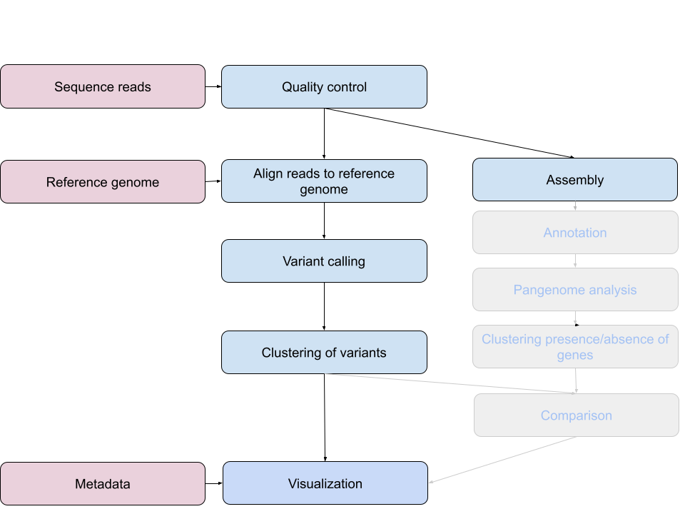

## Comparison of clustering results

We grouped (clustered) our isolates by the information that we extracted from the sequencing reads.
We compared our isolates to a reference genome and clustered them on basis of the single nucleotide variations that they exhibit when compared to this reference.

Next, we will visualize this clustering in the context of the meta data. Make sure you have the SNP tree that you generated (or can be downloaded here [core_snps.newick](../files/core_snps.newick)) on your own computer. 

## Visualization of genetic information and metadata

Visualization is frequently used to aid the interpretation of complex datasets. Within microbial genomics, visualizing the relationships between multiple genomes as a tree provides a framework onto which associated data (geographical, temporal, phenotypic and epidemiological) are added to generate hypotheses and to explore the dynamics of the system under investigation.

Download the meta data [file](../files/meta.csv) to your computer. Open Chrome. Go to [microreact](https://microreact.org/). Click on 'Upload'. Drag-and-drop the newick tree produced by snippy and phyml ([core_snps.newick](../files/core_snps.newick)). In the field URL, paste the following URL: [https://docs.google.com/spreadsheets/d/e/2PACX-1vRiRFoboS8hEEvgiFVyoeKnxjVrEyFoFJnfzkIKymmH13ZT9avmfHA7xZRLFN6dKRtlO7ViJhJGBZyw/pub?gid=0&single=true&output=csv](https://docs.google.com/spreadsheets/d/e/2PACX-1vRiRFoboS8hEEvgiFVyoeKnxjVrEyFoFJnfzkIKymmH13ZT9avmfHA7xZRLFN6dKRtlO7ViJhJGBZyw/pub?gid=0&single=true&output=csv) which is a table comprising metadata file. Choose 'Data (csv or tsv)' as file kind.

Explore the location, time and further meta data. Play around with the different visualization options with the help of the [documentation of microreact](https://docs.microreact.org/).

> ## Discussion
>
> 1. Which transmission events are likely based on the metadata (location, RFLP, date) alone?
> 2. Which transmission events are likely based on the SNP or pangenome data?
> 3. Draw a transmission tree if possible.
{: .discussion}

